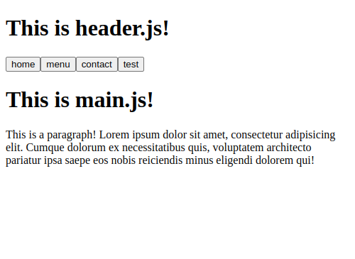

# odin-project-restaurant
This is the restaurant project from the Odin Project's javascript course!

**Link to project:** https://www.andyglover.io/odin-project-restaurant/

## How It's Made:

**Tech used:** JavaScript, Webpack

This project is to help me practice using webpack, and to generate a web page's contents using only javascript!

## Optimizations

Given more time, some improvements I would make to this project would be to add more content, and use webpack to import more images and CSS to style the site.

## Lessons Learned:

While working on this project, I learned how to deploy a webpack project to github pages, using the "gh-pages" package. I also learned how to use separate .js files to deploy content to web pages. I got practice exporting functions and re-using them in separate .js files.

## Examples:
Here's a few more repositories of mine you might like to check out:

**Admin Dashboard:** https://github.com/andyglover/odin-project-admin-dashboard

**Calculator:** https://github.com/andyglover/odin-calculator

**GIF Thingy:** https://github.com/andyglover/gif-thingy

**Library:** https://github.com/andyglover/odin-project-library

**Rock Paper Scissors:** https://github.com/andyglover/odin-rock-paper-scissors

**Tic-Tac-Toe:** https://github.com/andyglover/odin-project-tictactoe